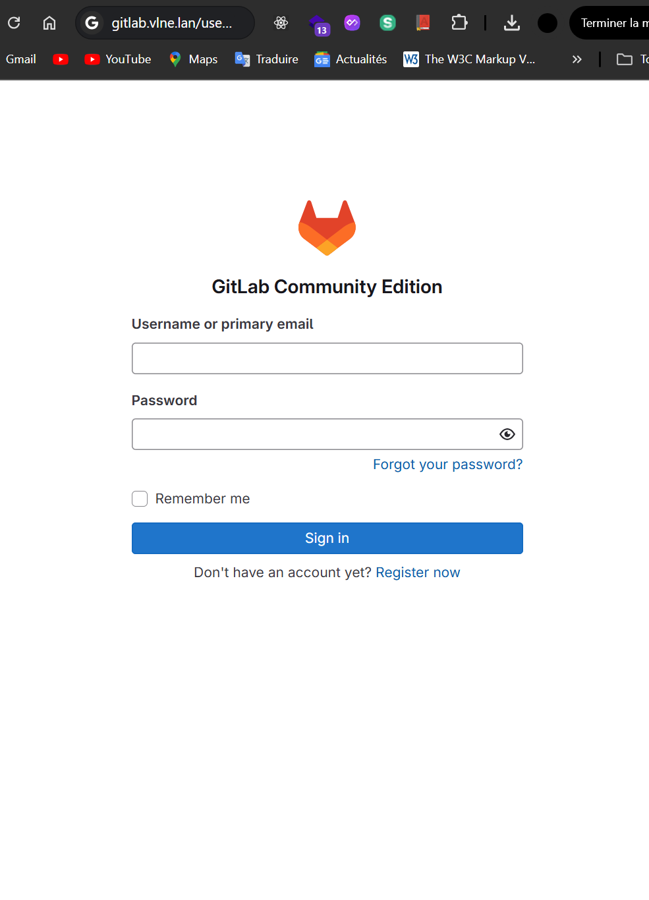
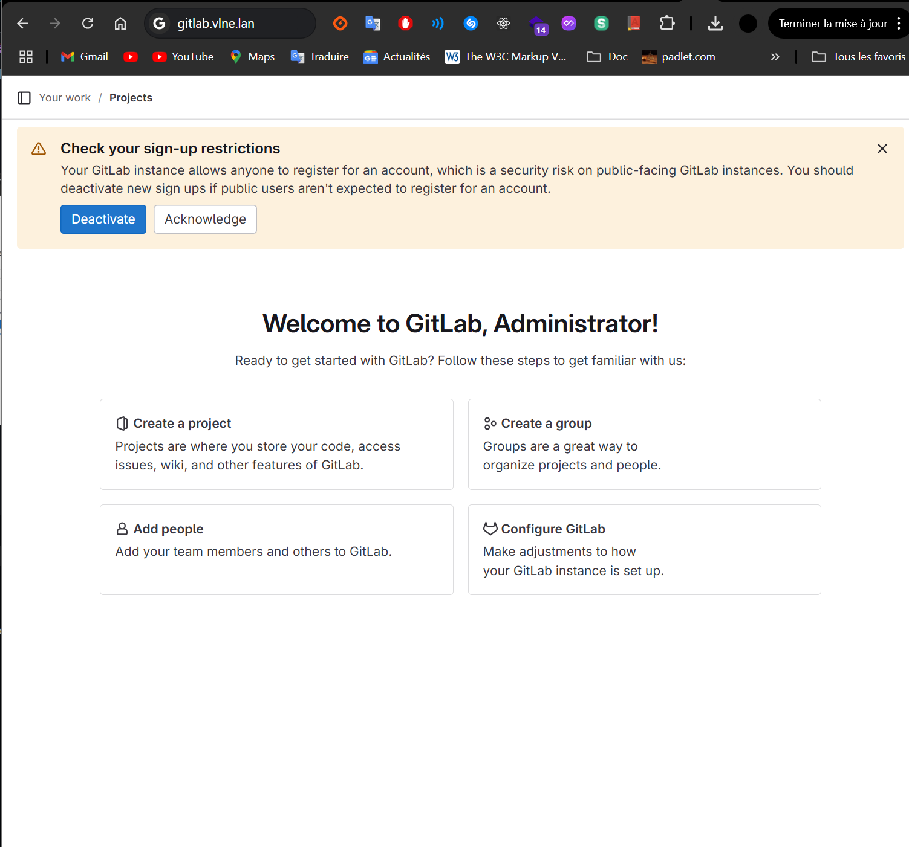

# Deploying a GitLab Server with Ansible

This project aims to deploy a GitLab server in an automated manner using Ansible. The process involves setting up a virtual machine for GitLab and automating its installation and configuration, as well as setting up a PostgreSQL database.

## Table of Contents

- [Prerequisites](#prerequisites)
- [Architecture](#architecture)
- [Deployment Steps](#deployment-steps)
- [Ansible Project Structure](#ansible-project-structure)
- [Usage](#usage)
- [Note](#note)
---

## Prerequisites

Before starting, ensure that you have:

- A virtual machine (VM) set up with a Linux distribution (Ubuntu Server, Debian, or Rocky Linux).
- Ansible installed on the control/master machine.
- SSH access configured between the control machine and the target VMs.
- Necessary ports open on the firewall (e.g., port 80 for HTTP and 22 for SSH).

---

## Architecture

This project deploys:
- One VM to host the GitLab server.
- An optional VM for a PostgreSQL database (depending on your requirements).

---

## Deployment Steps

1. **Configure Virtual Machines:**
   - Create two VMs (one for GitLab, one for PostgreSQL if needed).
   - Set up SSH access between your control machine and the VMs.

2. **Install Ansible:**
   - Install Ansible on the control machine via a package manager (e.g., `sudo apt install ansible`).

3. **Develop Ansible Roles:**
   - **`common` Role:** Sets up basic dependencies (updates packages, installs essential tools, etc.).
   - **`bdd` Role:** Deploys PostgreSQL and configures the required databases (`all`, `dev`, `stage`, `prod`).
   - **`gitlab` Role:** Installs and configures GitLab using Ansible variables.

---

## Ansible Project Structure

Your Ansible project should follow this structure:

```plaintext
ansible-project/
├── deploy.yml
├── inventory.yml
├── roles/
│   ├── common/
│   │   ├── tasks/
│   │   │   └── main.yml
│   │   ├── vars/
│   │   │   └── main.yml
│   │   └── handlers/
│   │       └── main.yml
│   ├── gitlab/
│   │   ├── tasks/
│   │   │   └── main.yml
│   │   ├── vars/
│   │   │   └── main.yml
│   │   └── handlers/
│   │       └── main.yml
│   └── bdd/
│       ├── tasks/
│       │   └── main.yml
│       ├── vars/
│       │   └── main.yml
│       └── handlers/
│           └── main.yml
```

test gitlab:





```sh
netstat -paunt
```


## Usage


```sh
ansible-playbook -i inventory.yml deploy.yml
```

## Note

If you want to clean, the host use the script refresh.sh.